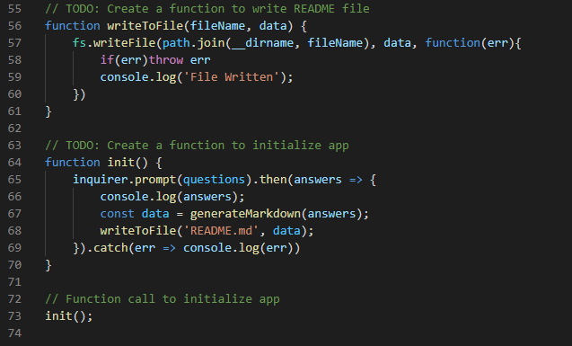
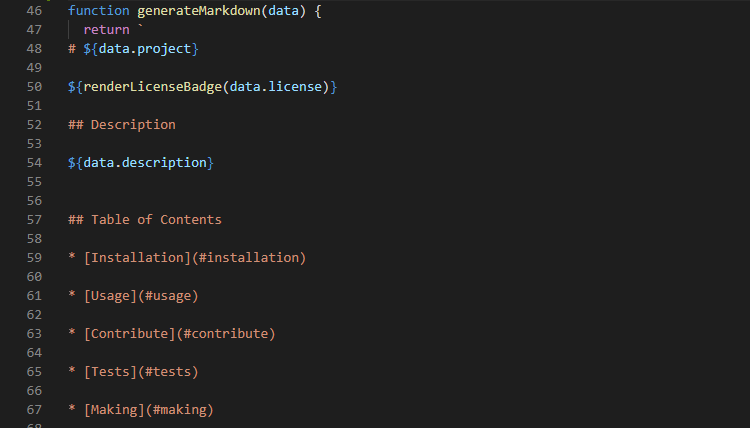
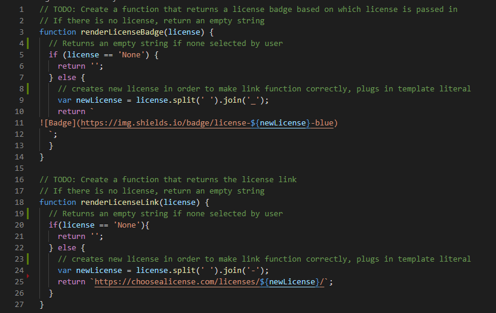

# README Generator

  

## Description

In this project I was prompted with the ask of creating a 'README.md' generator using Node.js. I was given starter code indicating which functions were to be used, and all of the files required. This process was relatively simple. Write the prompted questions, run them initally, take the answers and write the 'README.md' file using template literals. I was able to provide the user (myself) with a generator for a professional README.md file for all projects to come.

## Table of Contents

* [Installation](#installation)

* [Usage](#usage)

* [Contribute](#contribute)

* [Tests](#tests)

* [Making](#making)

* [Questions](#questions)

## Installation

In order to run this application, you will need to install the following:

  - npm init -y

## Usage

In order to use this app, you will need to understand the following langauges:

  - HTML, Node, Javascript

## Contribute 
    
In order to contribute, you will need to know the following languges:
    
  - HTML, Node, Javascript

## Tests

To run tests, please use the following command:

  - node index.js

## Making

How was it made? Take a look here!

Init Function

Generate Function

Generate License Function

## Questions

Please click the link to see my Full GitHub profile:

[GitHub](https://github.com/dnovelli1)

If you have any questions, please see the following links to best get in contact with me:

[Email Me](jakenovelli11@gmail.com)

## License

This project is currently licensed under the MIT [License](https://choosealicense.com/licenses/mit/)
  

